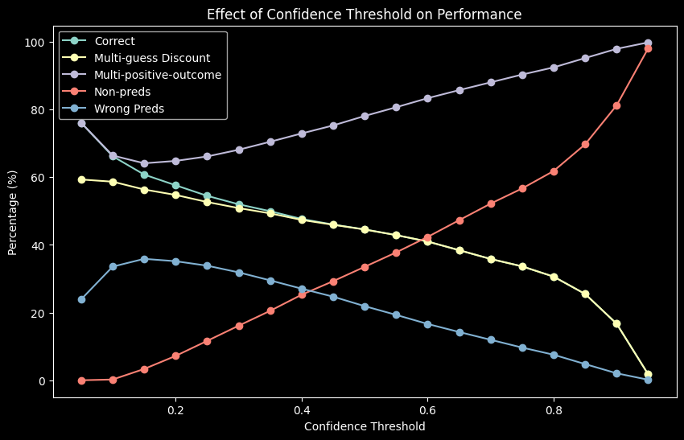

# Overview
**Models**: Hugging face implementation of BERT/DistilBERT and fine tuned them to classify texts.

**Structure**:

[Bert Docs](https://huggingface.co/docs/transformers/model_doc/bert)

## bert-base-uncased
From [huggingface website](https://huggingface.co/bert-base-uncased):
>BERT is a transformers model pretrained on a large corpus of English data in a self-supervised fashion. This means it was pretrained on the raw texts only, with no humans labeling them in any way (which is why it can use lots of publicly available data) with an automatic process to generate inputs and labels from those texts. More precisely, it was pretrained with two objectives:

>Masked language modeling (MLM): taking a sentence, the model randomly masks 15% of the words in the input then run the entire masked sentence through the model and has to predict the masked words. This is different from traditional recurrent neural networks (RNNs) that usually see the words one after the other, or from autoregressive models like GPT which internally masks the future tokens. It allows the model to learn a bidirectional representation of the sentence.
>Next sentence prediction (NSP): the models concatenates two masked sentences as inputs during pretraining. Sometimes they correspond to sentences that were next to each other in the original text, sometimes not. The model then has to predict if the two sentences were following each other or not.
>This way, the model learns an inner representation of the English language that can then be used to extract features useful for downstream tasks: if you have a dataset of labeled sentences, for instance, you can train a standard classifier using the features produced by the BERT model as inputs.

Model size: 110M params

## distilbert-base-uncased
From [distilbert page](https://huggingface.co/distilbert-base-uncased)
>DistilBERT is a transformers model, smaller and faster than BERT, which was pretrained on the same corpus in a self-supervised fashion, using the BERT base model as a teacher. This means it was pretrained on the raw texts only, with no humans labelling them in any way (which is why it can use lots of publicly available data) with an automatic process to generate inputs and labels from those texts using the BERT base model. More precisely, it was pretrained with three objectives:

>Distillation loss: the model was trained to return the same probabilities as the BERT base model.
>Masked language modeling (MLM): (Same as above)
>Cosine embedding loss: the model was also trained to generate hidden states as close as possible as the BERT base model. This way, the model learns the same inner representation of the English language than its teacher model, while being faster for inference or downstream tasks.

Model size: 67M params

Datasets used to train bert and distilbert:
* [English wikipedia](https://huggingface.co/datasets/wikipedia) 
* [Book corpus](https://huggingface.co/datasets/bookcorpus)(11,038 unpublished books)

# Preprocessing

For review text data, I combined the title and review body for simplicity and sent that through a text normalization function.

Current functionally:
* Expanding contractions
* Removing punctuation and any formatting characters
* Lowercase

I then one hot encoded the classes and converted that pandas df into a dataset from the datasets library with a train,test, and validation dataset. These are easier to us than pandas with the transformers library for training. 

Next I made a dict of the classes to correspond with an int.

# Tokenizer

For each model I used the corresponding tokenizer from huggingface. I used the same parameters for each.

    tokenizer(text, padding="max_length", truncation=True, max_length=256)

The max_length of 256 and subsequent truncation does cut off some data but my GPU (RTX 3070, 8gb VRam) was not able to handle anything larger with training batch size of 8. The padding is on the right as is recommended.

# Training

The training loop I used was based on [this implementation](https://colab.research.google.com/github/NielsRogge/Transformers-Tutorials/blob/master/BERT/Fine_tuning_BERT_(and_friends)_for_multi_label_text_classification.ipynb) which I found linked in the transformers documentation. It might be sightly outdated and sub-optimal based on the depreciation warnings thrown but it gets the job done. 

# Evaluation

### Explanation of confidence threshold

These models are set up to return the probability of each text example belonging to each class. To convert to binary outcomes an arbitrary threshold is set. Everything above is a prediction, everything below is not. A very low threshold might return 3 or more predictions, indicating that the model is moderately confident the correct classification is included in the set of predictions, but the usefulness of this depends on the specifics of each use case. If classification into a single class is necessary it will have to be manually classified anyway and having a short list could prove useful.A high threshold returns a lower proportion of wrong predictions, but also a much higher proportion of non predictions. In the case of single class classification, these non predictions would still have to be manually classified. The graphs below highlight this, and the right balance will have to be determined depending on the circumstances of each case. 

The confidence threshold used in the training loop 0.5 for all of the models. Finding an optimal value for each use is a chance to improve the fine tuning, but has not been explored yet. 

### Explanation of multi-guess penalty

The way the accuracy of each model is calculated is correct predictions get a 1 and incorrect predictions get a 0. At low confidence thresholds the model can return many predictions for each example. I wanted a way to include this in the evaluation as it is not useful if the model is predicting every class for each example which inflates the accuracy. The formula is 0.9^(number of classes guessed). For 2 guesses it would score a 0.81 instead of a 1, for 3 guesses 0.73, 4 guesses 0.65, etc. This is arbitrary, constant values from 0.8 to 0.9 gave a decent representation of performance. It quickly converges with the correct category at thresholds above 0.3 or so because the model starts returning only 1 prediction.

## Amazon reviews classified to product category

Data Example:
| Review | Product category |
| :--------: | :-------: |
| perfect just what i needed perfect for western theme party | apparel |

Model: bert-base-uncased

Training size: 100k

Training time: 2 hrs

Number of classes: 30

Evaluation dataset results:
* eval loss: 0.083
* eval f1: 0.523
* eval roc acc: 0.711
* eval accuracy: 0.428

Results on unseen test data(%):

Model: bert-base-uncased (same as above with less training data)

Training size: 10k

Training time: 12 mins

Number of classes: 30

Evaluation dataset results:
* eval loss: 0.105
* eval f1: 0.227
* eval roc acc: 0.567
* eval accuracy: 0.136

Results on unseen data(%):

## Movie plots classified to genre

Data Example:
| Text | Genre |
| :--------: | :-------: |
| three schoolgirls are infatuated with a yakuza...	 | crime |

Model: distilbert-base-uncased

Training size: 18244

Training time: 12 mins

Number of classes:  100

Evaluation dataset results:
* eval loss: 0.031
* eval f1: 0.398
* eval roc acc: 0.648
* eval accuracy: 0.299

Results on unseen test data(%):

## News headlines classified to news category

Data Example:
| Text | Genre |
| :--------: | :-------: |
| tips for your child s first summer sleep away ...	.	 | PARENTS |

Model: bert-base-uncased

Training size: 18750

Training time: 24 mins

Number of classes:  41

Evaluation dataset results:
* eval loss: 0.0537
* eval f1: 0.595
* eval roc acc: 0.743
* eval accuracy: 0.490

Results on unseen test data(%):

# Things to do

* Get RoBerta to work. [notebook](https://colab.research.google.com/github/DhavalTaunk08/NLP_scripts/blob/master/sentiment_analysis_using_roberta.ipynb)

* Training confidence threshold

* In evaluation, test confidence thresholds from 0.01 to 0.1. Optimal value might lay in this range
 
 * Deberta notebook working, needs to be trained on more data. Takes much longer than bert to train due to batch size being cut in half to avoid memory errors. 

 * Deberta-v2 is too big to fit on this machine even with batch size = 1